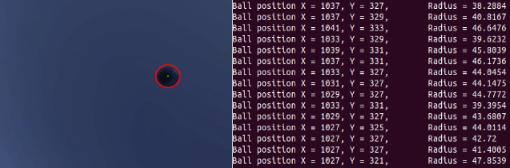
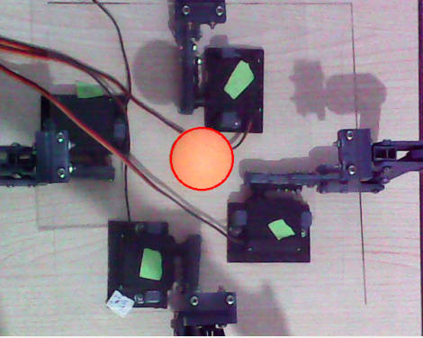
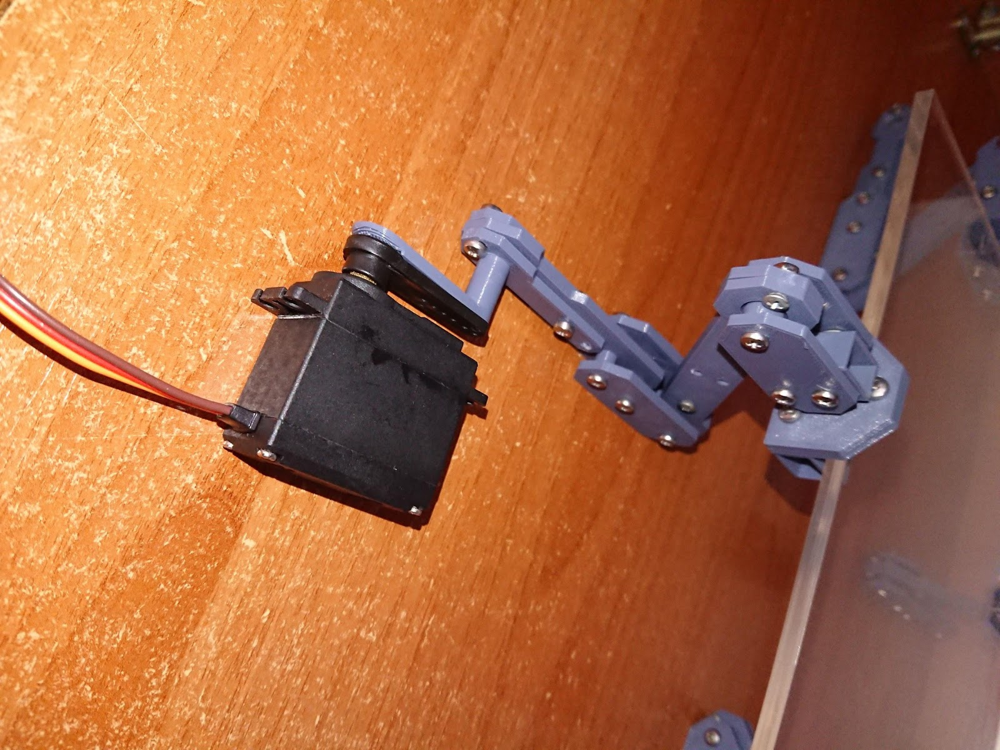
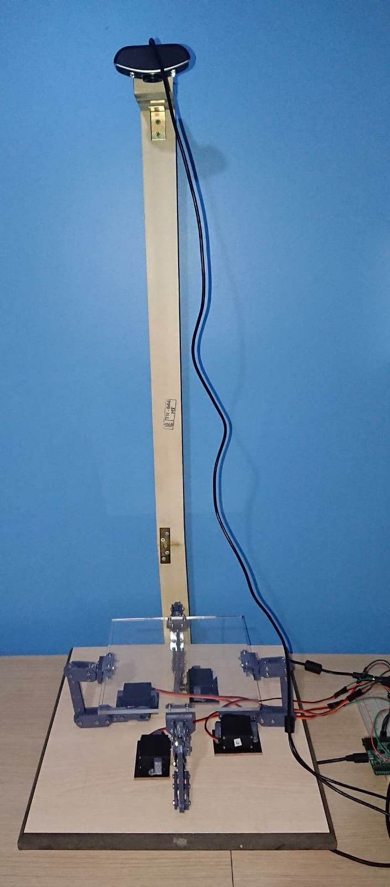
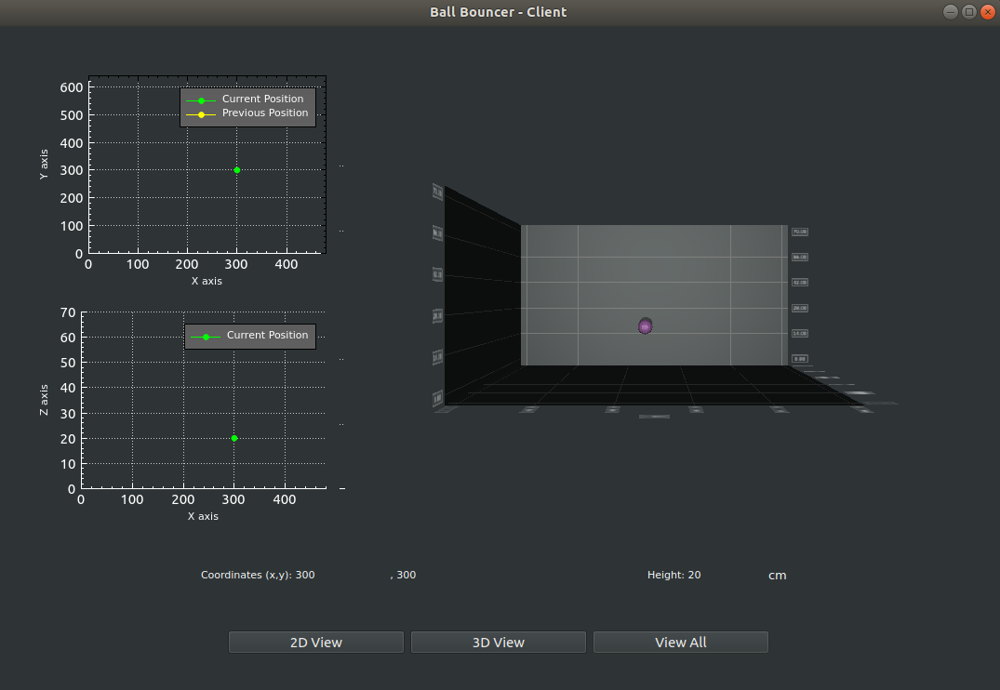
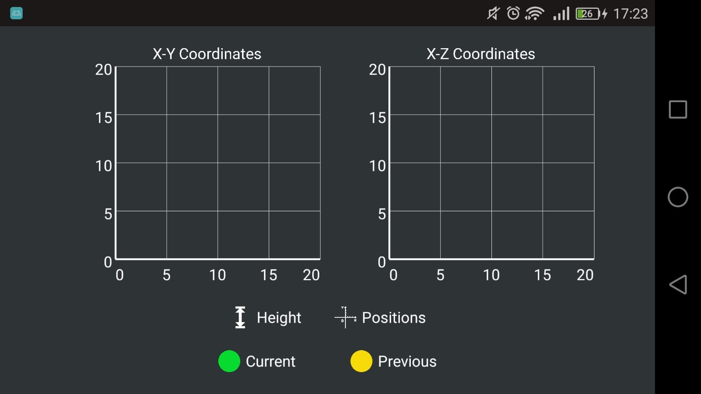
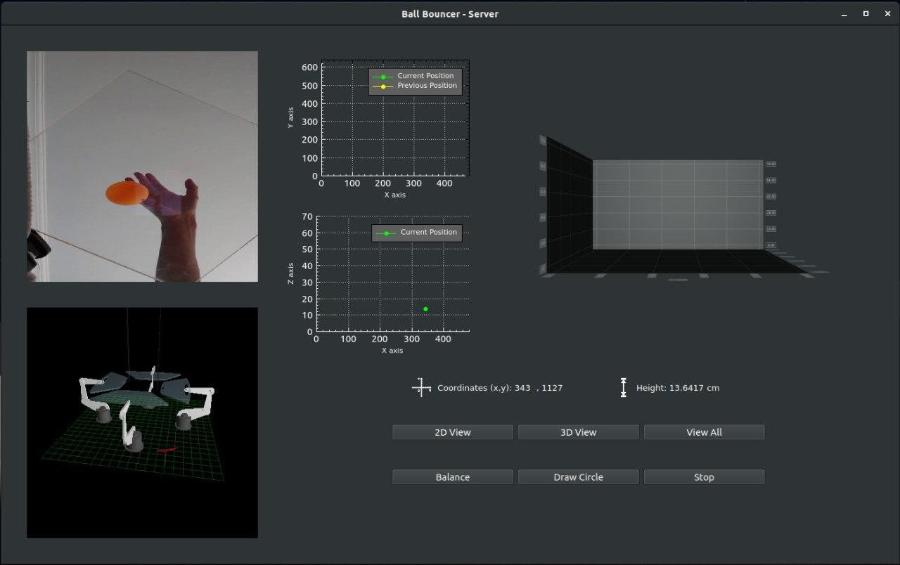
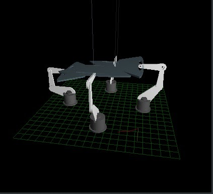

The aim of the group project is to construct a ping pong ball bouncer. The overall position on the plate (with respect to x and y coordinates) and an estimate of the height of the ball above the plate should be plotted in real-time both on a host computer and a remote mobile device (an android phone). The mechanism should also be able to move a ping pong ball placed on top of the glass table in a predetermined 2D trajectory.

Image Processing
======
This module uses OpenCV to process data from the camera. The data is analyzed and the radius, height, velocity, location attributes of the ball is calculated. These outputs are sent to the PID ControllerModule and Simulation Modues.
[Github Code](https://github.com/oguzhanagkus/ball-bouncer/blob/master/test-codes/image-processing/color_tracking.cpp).

Mechanical Design & Implementation
======
This module consist of design and implementation the mechanical body of the project. The body has a transparent plate and servo-controlled four arms. The servos are controlled by a microcontroller. The microcontroller communicates with the controller device (PID Controller) via a serial port.
 

PID Controller
------
This module performs all mathematical and physical calculations. With the Image Processing Module sending the properties of the ball such as the velocity, the coordinate information calculates the movements of the servos in order to balance the ball. The communication with the mechanical body is done via a serial port.
[Github Code](https://github.com/oguzhanagkus/ball-bouncer/tree/master/test-codes/loadBalacer-server/loadBalacer-serverV4).

Mobile and Desktop Applications
------
This module displays the 2D picture of the ball in real-time according to the coordinates and radius value received from the server computer. These data are received from the server via wifi. Real-time plotting will be shown both in mobile (Android) and computer (Linux and Windows). All modules are integrated with Qt Server Application. Since Qt supports OpenCV and OpenGL, the simulation module, the image processing code, the PID code, UDP connection, Serial Port connections are successfully integrated to this platform. 
[Github Code](https://github.com/oguzhanagkus/ball-bouncer/tree/master/mobile-app).

Simulation Module
------
This module takes the coordinates of the ball such as X,Y coordinates and height information, servo motor informaion and animates it. OpenGL platform is used for animating in the interface of both server and client applications.
 

About Us
------
We are Gebze Technical University, Computer Engineering Department third year students. We came together within the scope of the CSE396 Computer Engineering Project course and made this project, consisting of 5 different modules: image processing, mechanical design & implementation, PID controller,mobile and desktop application, simulation.We thank our course instructor Prof. Dr. Erkan ZERGEROĞLU, for providing us for this experience.
