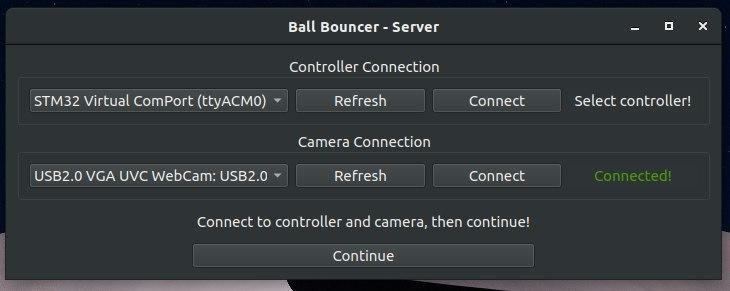

Camera and stm communication cable must be connected to the host computer.
Camera and stm communication port must be selected over the server application.
 

 
After the connections are successful, ping pong ball balance and circle commands can be
given to the embedded system via the server application. If you want to stop the system,
the stop button should be used. Then you can switch to the other command you want.
 

 
You can follow the camera and simulation live from the server application.
  
[Download Windows Server App](https://drive.google.com/file/d/1d2MUx6G0jIgCPmNlbPAnkBrRFqReaDac/view?usp=sharing). (Download and install installerserver.exe file. Then you can execute with created executable server file). 
[Download Debian Based Linux Server App](https://drive.google.com/file/d/1zlhuZJRsyQbLbgAfyA3k_4q8ECMD1tWT/view?usp=sharing). 
[Download Red Hat Based Linux Server App](https://drive.google.com/file/d/1-szmUWDnNqYDfc6aIumJfNsbrYPDxxjh/view?usp=sharing). 
Note : sudo chmod 777 /dev/ttyACM* # do this command when you open app.  
( We offer 3 installation options for server app because of OpenCV. It might fail to find shared libraries. 
  1 - Download this and run server.sh 
  If it fails, try option 2 
  2 - Make sure that OpenCV 4.4 and OpenGL 4.6 installed on your system successfully. Then download this and run server.sh 
  If it fails too, try option 3. 
  3 - Make sure that OpenCV 4.4 and OpenGL 4.6 and QT 5.15 installed on your system successfully. Then download the project source code and open with QT Creator, and build it then run. [Source Code](https://drive.google.com/file/d/1IzxJE7Hz5Um6u59_gSusWgpBR9nzZjx8/view?usp=sharing).)  
    - Make your QT setup according to your operating system. [Qt Setup](https://download.qt.io/official_releases/qt/5.14/5.14.2/).  
    - To open project open qtcreator and press Open file or project from the file menu.  
    - Then select server-app/server.pro in the source code. [Video Link](https://www.youtube.com/watch?v=kL0qfuLqB0U) (You can make changes by following this video from the second minute.) 
    - You can run the program by running from the left menu after pressing the configure project button 
